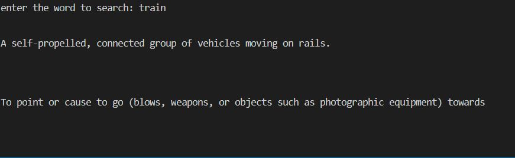

# English-dictionary
This an english based dictionary that uses a JSON file to find the meaning for different words. If you mispelled a word it will automatically recommends a similar word.If there are more than one meaning to a word it will display them all.

## How to use
```bash
python Dictionary.py
```

## Screenshot

